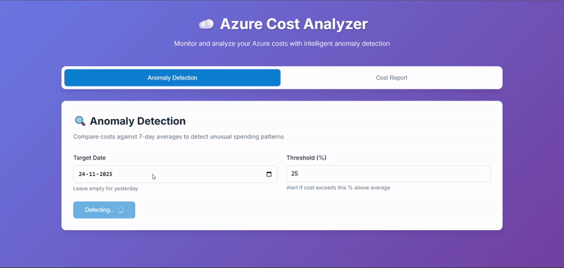

# Azure Cost Analyzer



A modern web application for monitoring Azure costs with intelligent anomaly detection and automated reporting.

## Features

- **Anomaly Detection**: Compare daily costs against 7-day averages with customizable thresholds
- **Cost Reports**: Generate comprehensive Word documents with cost breakdowns
- **FastAPI Backend**: High-performance REST API with automatic documentation
- **Multi-Subscription Support**: Monitor multiple Azure subscriptions simultaneously

## Prerequisites

- Python 3.8 or higher
- Azure subscription with appropriate permissions
- Azure AD application with client credentials

### 2. Set Up Azure AD Application

1. Go to Azure Portal → Azure Active Directory → App registrations
2. Create a new app registration
3. Note down:
   - **Tenant ID** (Directory ID)
   - **Client ID** (Application ID)
4. Go to "Certificates & secrets" → Create a new client secret
5. Note down the **Client Secret** value
6. Go to "API permissions" → Add permission → Azure Service Management → user_impersonation
7. Grant admin consent

### 3. Assign Subscription Permissions

For each subscription you want to monitor:
1. Go to Subscriptions → Select subscription
2. Access Control (IAM) → Add role assignment
3. Assign "Cost Management Reader" role to your app registration

### 4. Create Environment File

In the `backend/` directory, create a `.env` file:

```bash
# Azure AD Configuration
AZURE_TENANT_ID=your-tenant-id
AZURE_CLIENT_ID=your-client-id
AZURE_CLIENT_SECRET=your-client-secret

# Subscription IDs
SUBSCRIPTION_MAIN=your-main-subscription-id
SUBSCRIPTION_PROD=your-prod-subscription-id
SUBSCRIPTION_DEV=your-dev-subscription-id
SUBSCRIPTION_TEST=your-test-subscription-id

# API Configuration (optional)
API_HOST=0.0.0.0
API_PORT=8000
OUTPUT_DIRECTORY=../outputs
```

### Anomaly Detection

1. Click on the "Anomaly Detection" tab
2. Select a target date (defaults to yesterday)
3. Set your threshold percentage (default: 25%)
4. Click "Detect Anomalies"
5. View results showing which subscriptions have anomalous costs

### Cost Report Generation

1. Click on the "Cost Report" tab
2. Enter the number of days to analyze (1-90)
3. Click "Generate Report"
4. Download the generated Word document

## API Documentation

Once the backend is running, visit:
- **Swagger UI**: `http://localhost:8000/docs`
- **ReDoc**: `http://localhost:8000/redoc`

### Main Endpoints

#### Anomaly Detection
- `POST /api/anomaly/detect` - Detect anomalies for a specific date
- `GET /api/anomaly/history` - Get anomaly history for multiple days

#### Cost Reports
- `POST /api/cost-report/generate` - Generate a cost report
- `GET /api/cost-report/download/{filename}` - Download generated report

#### Health Check
- `GET /api/health` - Check API health status


