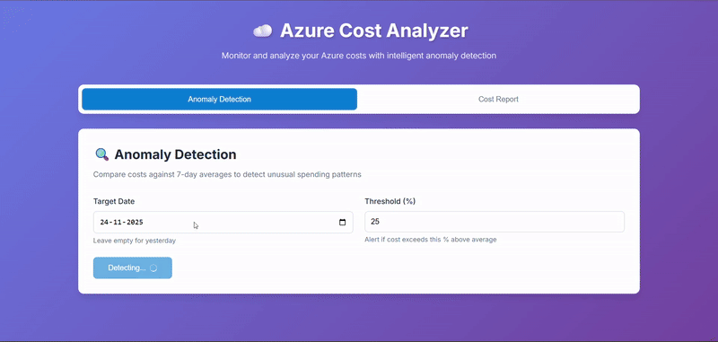

# Azure Cost Analyzer



A modern web application for monitoring Azure costs with intelligent anomaly detection, automated reporting, and **AI-powered conversational analysis**.

## Features

- **AI Cost Assistant**: Natural language interface for cost analysis powered by OpenAI GPT-4
  - Ask questions in plain English about your Azure costs
  - Multi-turn conversations with context retention
  - Automatic tool selection (subscriptions, costs, anomalies)
  - Smart insights and recommendations

- **Anomaly Detection**: Compare daily costs against 7-day averages with customizable thresholds
  - Service-level cost tracking
  - Configurable alert thresholds
  - Visual indicators for unusual spending

- **Cost Reports**: Generate comprehensive Word documents with cost breakdowns
  - Multi-day analysis
  - Subscription and service summaries
  - Downloadable reports

- **FastAPI Backend**: High-performance REST API with automatic documentation
- **Secure Configuration**: Session-based credential management
- **Multi-Subscription Support**: Monitor multiple Azure subscriptions simultaneously

## Prerequisites

- Python 3.8 or higher
- Azure subscription with appropriate permissions
- Azure AD application with client credentials
- **OpenAI API key** (for AI Agent feature)

## Installation

### 1. Clone Repository

### 2. Set Up Azure AD Application

1. Go to Azure Portal → Azure Active Directory → App registrations
2. Create a new app registration
3. Note down:
   - **Tenant ID** (Directory ID)
   - **Client ID** (Application ID)
4. Go to "Certificates & secrets" → Create a new client secret
5. Note down the **Client Secret** value
6. Go to "API permissions" → Add permission → Azure Service Management → user_impersonation
7. Grant admin consent

### 3. Assign Subscription Permissions

For each subscription you want to monitor:
1. Go to Subscriptions → Select subscription
2. Access Control (IAM) → Add role assignment
3. Assign **"Cost Management Reader"** role to your app registration

### 4. Get OpenAI API Key

1. Sign up at [OpenAI Platform](https://platform.openai.com)
2. Navigate to API keys section
3. Create a new API key
4. Note down the key (starts with `sk-...`)

### 5. Create Environment File

In the `backend/` directory, create a `.env` file:

```bash

# OpenAI Configuration (for AI Agent)
OPENAI_API_KEY=sk-your-openai-api-key

# API Configuration (optional)
API_HOST=0.0.0.0
API_PORT=8000
OUTPUT_DIRECTORY=../outputs
```

### 6. Install Python Dependencies

```bash
cd backend
pip install -r requirements.txt
```

### 7. Start the Backend Server

```bash
python main.py
```

The API will be available at `http://localhost:8000`

### 8. Open the Frontend

```bash
cd ../frontend
# Open index.html in your browser
# Or use a local server:
python -m http.server 8080
# Then visit http://localhost:8080
```

## Usage

### Initial Configuration

1. Open the application in your browser
2. Go to the **Configuration** tab
3. Enter your Azure credentials:
   - Tenant ID
   - Client ID
   - Client Secret
4. Click **"Test Connection"** to verify credentials
5. Configure your subscriptions:
   - Set the number of subscriptions
   - Enter Subscription IDs and Names
6. Click **"Save Configuration"**

Once configured, all tabs will be enabled!

---

### AI Cost Assistant (NEW!)

The AI Agent provides a conversational interface for analyzing your Azure costs.

#### How to Use

1. Click on the **"AI Agent"** tab
2. Type your question in natural language
3. Press Enter or click Send
4. View the AI's response with automatic data analysis

#### Example Queries

```
"What were the costs for my subscriptions yesterday?"
"Show me Virtual Machine spending for the last 7 days"
"Check for any cost anomalies this week"
"Compare production vs development costs"
"Are there any unusual spikes in spending?"
"What's the most expensive service in prod?"
```

#### Features

- **Multi-turn Conversations**: The AI remembers context from previous messages
- **Automatic Tool Selection**: Intelligently uses the right Azure APIs
- **Tool Visualization**: See which data sources are being queried
- **Conversation Management**: Create, switch, and delete conversations
- **Natural Insights**: Get explanations, not just raw numbers

#### Under the Hood

The AI Agent uses:
- **OpenAI GPT-4** for natural language understanding
- **LangChain** for tool orchestration
- **Three Azure Tools**:
  1. `get_subscription_list` - List configured subscriptions
  2. `get_cost_summary` - Fetch cost data for date ranges
  3. `detect_anomalies` - Run anomaly detection analysis

---

### Anomaly Detection

1. Click on the **"Anomaly Detection"** tab
2. Select a target date (defaults to yesterday)
3. Set your threshold percentage (default: 25%)
4. Click **"Detect Anomalies"**
5. View results showing which subscriptions have anomalous costs

**How it works:**
- Compares target date costs against 7-day rolling average
- Flags services exceeding the threshold percentage
- Shows per-service breakdowns

---

### Cost Report Generation

1. Click on the **"Cost Report"** tab
2. Enter the number of days to analyze (1-90)
3. Click **"Generate Report"**
4. Download the generated Word document

**Report includes:**
- Executive summary
- Per-subscription cost breakdowns
- Service-level analysis
- Daily trends

---

## API Documentation

Once the backend is running, visit:
- **Swagger UI**: `http://localhost:8000/docs`
- **ReDoc**: `http://localhost:8000/redoc`

### Main Endpoints

#### Configuration
- `POST /api/config/save` - Save Azure credentials and subscriptions
- `POST /api/config/test` - Test Azure connection
- `GET /api/config/validate` - Validate existing session
- `DELETE /api/config/clear` - Clear configuration

#### AI Agent (NEW!)
- `POST /api/agent/chat` - Send message to AI agent
  ```json
  {
    "session_id": "xxx",
    "message": "What were costs yesterday?",
    "conversation_id": "optional-existing-conversation-id"
  }
  ```
- `POST /api/agent/conversation/new` - Create new conversation
- `GET /api/agent/conversations` - List all conversations for session
- `DELETE /api/agent/conversation/{id}` - Delete conversation
- `GET /api/agent/conversation/{id}/history` - Get conversation messages

#### Anomaly Detection
- `POST /api/anomaly/detect` - Detect anomalies for a specific date
  ```json
  {
    "session_id": "xxx",
    "target_date": "2024-01-15",
    "threshold_percent": 25
  }
  ```

#### Cost Reports
- `POST /api/cost-report/generate` - Generate a cost report
  ```json
  {
    "session_id": "xxx",
    "num_days": 7
  }
  ```
- `GET /api/cost-report/download/{filename}` - Download generated report

#### Health Check
- `GET /api/health` - Check API health status

---

## Architecture

### Backend Stack
- **FastAPI** - High-performance async API framework
- **LangChain** - AI agent orchestration
- **OpenAI GPT-4** - Natural language processing
- **Azure SDK** - Cost Management API integration
- **python-docx** - Word document generation

### Frontend Stack
- **Vanilla JavaScript** - ES6 modules
- **CSS3** - Modern responsive design
- **No framework dependencies** - Fast and lightweight

### Data Flow

```
User → Frontend UI → Backend API → Azure Cost Management API
                           ↓
                      OpenAI API (for AI Agent)
                           ↓
                      Response → Frontend Display
```

### Session Management
- 30-minute session timeout
- In-memory credential storage (not persisted to disk)
- Session ID stored in browser sessionStorage
- Automatic cleanup on expiration
  

## Development

### Running in Development Mode

```bash
# Backend with auto-reload
cd backend
uvicorn main:app --reload --port 8000

# Frontend with live server
cd frontend
python -m http.server 8080
```


